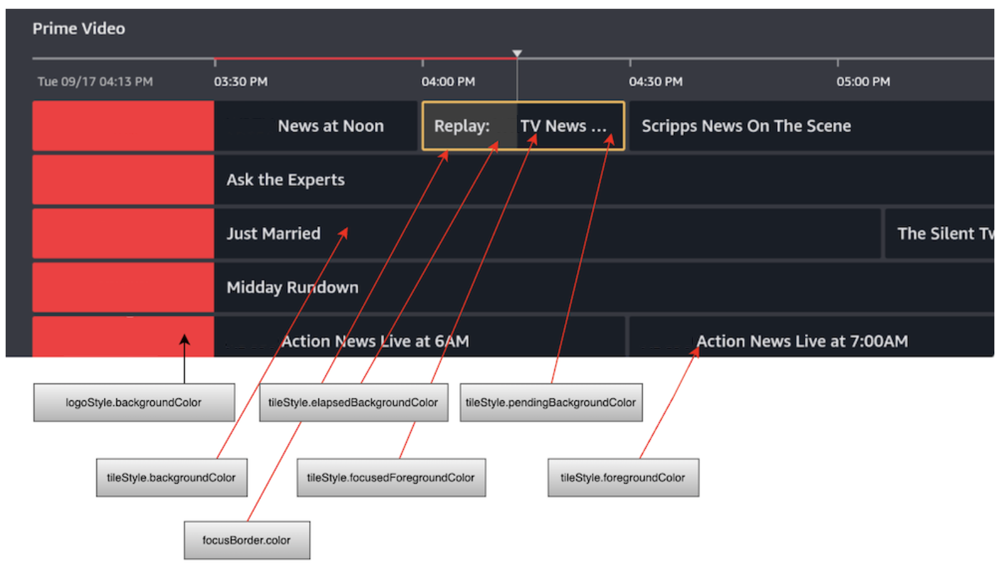
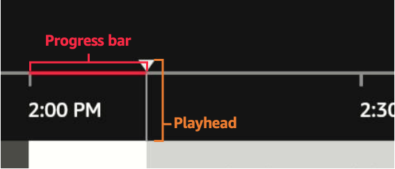
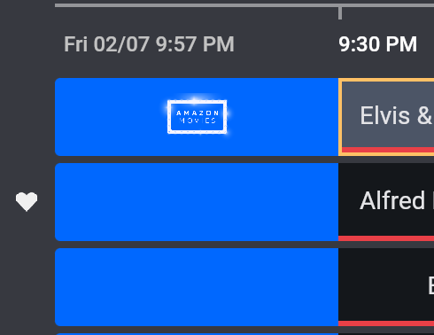

Vega EPG Sample App
=========================

Introduction
------------

The EPG (Electronic Program Guide) Sample App demonstrates how to use the EPG components to build a TV Guide experience.


Build and run the app
--------------------

### Prerequisites

Before you launch the sample app, make sure that you have [installed the Vega SDK](https://developer.amazon.com/docs/vega/0.21/install-vega-sdk.html).


### Step 1: Build the app

After you download the source code from GitHub, you can build the EPG Sample App from the command line to generate VPKG files. The VPKG files run on the Vega Virtual Device and Vega Fire TV Stick.

You can also use [Vega Studio](https://developer.amazon.com/docs/vega/0.21/setup-extension.html) with Visual Studio Code to build the app.

1. At the command prompt, navigate to the EPG Sample App source code directory. 

2. To install the app dependencies, run the following command. 

   ```
   npm install
   ```

3. To build the app to generate .vpkg files, run the following command.

   ```
   npm run build:app
   ```

4. At the command prompt, in the **build** folder, verify that you generated the VPKG files for your device's architecture.

   * **armv7-release/epgsampleapp_armv7.vpkg**&mdash;generated on x86_64 and Mac-M series devices to run on the Vega Fire TV Stick.
   * **x86_64-release/epgsampleapp_x86_64.vpkg**&mdash;generated on x86_64 device to run on the KVD.
   * **aarch64-release/epgsampleapp_aarch64.vpkg**&mdash;generated on Mac M-series device to run on the KVD.
   
### Step 2: Run the app

#### Vega Virtual Device

1. To start the Vega Virtual Device, at the command prompt, run the following command.

   ```
   kepler virtual-device start
   ```

2. Go to the directory where you placed the VPKG files. 

3. To install and launch the app on the Vega Virtual Device, run the following command, depending on your device architecture.

   - On Mac M-series based devices. 
      
      ```
      kepler run-kepler build/aarch64-release/epgsampleapp_aarch64.vpkg
      ```

   - On x86_64 based devices.
      
     ```
     kepler run-kepler build/x86_64-release/epgsampleapp_x86_64.vpkg
     ```  

#### Fire TV Stick

1. Turn on your Fire TV Stick.

2. To install and launch the app on your Fire TV Stick, run the following command.

   ```
   kepler run-kepler build/armv7-release/epgsampleapp_armv7.vpkg
   ```


Update your package.json file
-----------------------------

The EPG component is available through the KUIC library. Make sure your **package.json** lists KUIC in its **dependencies** section as shown below.

```json
"dependencies": {
    // ...
    "@amazon-devices/kepler-ui-components": "^2.0.0",
}
```


The `^` in the semver expression indicates that any new versions before 3.0.0 can be taken automatically.

To learn more about getting started with KUIC, see [Get Started with the Vega UI Component Library](https://developer.amazon.com/docs/vega-api/0.21/get-started.html).

EPG component usage and props
-----------------------------

The following code example shows the usage of EPG. The EPG component must also be provided with channel and program data through the [`updateData`](#updatedata-method) method.

```ts
<EPG
    ref={epg}
    onScroll={({ row, timeMs }: EPGScrollEvent) => {
        // handler code here
    }}
    onTileFocus={({ payload, title }: EPGTileFocusEvent) => {
        // handler code here
    }}
    onTilePress={({ payload, title }: EPGTilePressEvent) => {
        // handler code here
    }}
    onMenu={({ payload, title }: EPGMenuEvent) => {
        // handler code here
    }}
    focusBorder={{
        enabled: true,
        color: '#E4E4E7',
    }}
    tileStyle={{
        backgroundColor: '#191E25',
        foregroundColor: '#E4E4E7',
        focusedForegroundColor: '#E4E4E7',
        elapsedBackgroundColor: '#3D3D3D',
        pendingBackgroundColor: '#191E25',
    }}
    logoStyle={{
        backgroundColor: '#FF0E25',
        width: 340,
    }}
/>
```


|Prop	|Description	|Type	|Optional	|Default|
|---	|---	        |---	|---	    |---	|
| `onScroll` | Callback when the user moves around to different cells, after animation is complete.	| `(event: EPGScrollEvent) => void`	| Yes | 	|	
| `onTileFocus` | Callback when the user focuses on a cell (lands on it for 250ms or longer). | `(event: EPGTileFocusEvent)` | No	|	|	
| `onTilePress` | Callback when user selects a cell.	| `(event: EPGTilePressEvent) => void` | No	|	|
| `onMenu` | Callback when the menu (3 lines) button is pressed. | `(event: EPGInteractionEvent) => void` | Yes |  |	
| `onMetricEmit` | Callback when certain metrics, related to performance, are fired. | `(event: EPGMetricsEmitEvent) => void` | Yes | |	
| `favoriteStyle` | Container for the favorite related props. | | Yes | |	
| `favoriteStyle.imageOn` | Specify the image in **assets/image** to use for a channel that is a favorite. | | Yes | With no image provided, the favorite functionality is off, with no visual indicator of the favorite status. |	
| `favoriteStyle.imageOff` | Specify the image in **assets/image** to use for a channel that is not a favorite. | `ColorValue` | Yes | #E94047 |	
| `focusBorder`	| Container for focus border props. |  | Yes	|  |	
| `focusBorder.enabled` | Whether to display a border around the focused cell. | `boolean` | Yes	| `FALSE` |	
| `focusBorder.color` | What color value (in hex) to use for the focused cell border. |`ColorValue`	| Yes | #FFC166 |	
| `localizedStrings` | Allows users to specify the text that appears in the EPG. `localizedStrings` specifically modifies the text that is not determined by the data. |  | Yes |  |
| `localizedStrings.loadingText`  | `loadingText` appears on program tiles when data has not been loaded yet. | string | Yes | "Loading schedule..." |	
| `localizedStrings.unavailableText` | `unavailableText` appears on program tiles that have loaded data, but the data is invalid. | string | Yes | Programming information unavailable."  |	
| `localizedStrings.favoriteAccessibilityLabel` | `favoriteAccessibilityLabel` is used to create the accessibility label for a channel. This text specifically describes if the channel is a favorite or not. | string | Yes | "Favorite" |	
| `logoStyle` | Container for channel logo related style props.	|	|Yes	|	|	
| `logoStyle.backgroundColor` | Background color for channel logo cells on the left side of the grid. | `ColorValue` | Yes | #4A4A4A |	
| `logoStyle.width` | Width in pixels for the channel logo cells on the left side of the grid (this also affects the space reserved on the left side of the timeline bar at the top). | `number` | Yes | 363 |	
| `overlayStyle` | Container for overlay props (the term overlay referring to a 'progress bar' type indicator within the program cells showing the viewer the current time's position within the program). |  | Yes |	|
| `overlayStyle.enabled` | Prop to show an overlay within each program tile. | `boolean` | No (if overlayStyle is specified) | `FALSE` |	
| `overlayStyle.pendingColor` | Color to use for the section of the overlay representing the program that is still yet to be shown. | `ColorValue` | Yes | #3D3D3D |	
| `overlayStyle.elapsedColor` | Color to use for the section of the overlay representing the program that has already aired. | `ColorValue` | Yes | #E94047 |	
| `tileLayout` | Specifying the layout variant for each program tile: by default in 'standard' mode only title is shown. In 'expanded' description is also shown and autogenerated text specifying how many minutes are left in the program. | `standard` <br> `expanded` | Yes	| `standard` |	
| `tileStyle` | Container for tile style props.	| | Yes |	|	
| `tileStyle.backgroundColor` | Default background color (in hex). | `ColorValue` | Yes | #2A2A2A |	
| `tileStyle.foregroundColor` | Default foreground (text) color (in hex). | `ColorValue` | Yes | #F0F0F0 |	
| `tileStyle.focusedForegroundColor` | Foreground text color for a focused cell.	| `ColorValue` | Yes | #1A1A1A |	
| `tileStyle.elapsedBackgroundColor` | Background color for the part of a cell which has elapsed (for a program which is currently on). | `ColorValue` | Yes | #F0F0F0 |	
| `tileStyle.pendingBackgroundColor` | Background color for the part of a cell which is pending (for a program which is currently on). | `ColorValue` | Yes | #C2C2C2 |	
| `tileStyle.rowHeight` | Height in pixels of each row.	| `number` |  | 96 |	
| `tileStyle.fontSize`	| Font size for text in program tiles (there are other sizes used by EPG which are not yet customizable). | `number` |  | 32 |	
| `tileStyle.boldFocusedTitle` | Boolean which controls whether bold text style is used for the tile which is in focus. | `boolean` | Yes | `FALSE` |	
| `tileStyle.borderRadius` | The border radius value specified here (in pixels) is used for the shape of the cells containing program tiles and the channel logos, where a higher value results in rounder corners. A value of 0 would provide square corners. | `number` | Yes | 4 |	
| `tileStyle.tileSpacing` | The number of pixels of extra space between the program tiles. | `number` | Yes | 8 |
| `timeRange` | Affects the time span of the grid and the position of the EPG along it. |  | Yes |  |
| `timeRange.starTimeMs` | `startTimeMs` sets the start of the EPG's grid. It can be set in the past to view previously played programs. `startTimeMs` can't be greater than the current time. | number | Yes | The current time rounded down to the nearest 30 minutes. In units of milliseconds from epoch, for example, 1745276430000. |
| `timeRange.initialPosition` | `initialPosition` sets the initial time frame viewed when the EPG is loaded for the first time. `initialPosition` can't be greater than the current time. | number | Yes | The current time rounded down to the nearest 30 minutes. In units of milliseconds from epoch, for example, 1745276430000. |
| `timelineStyle` | Prop containing options for the timeline. |  | Yes |  |
| `timelineStyle.progressBar` | The timeline props for progress bar component. | | Yes	|  |	
| `timelineStyle.progressBar.hidden` | Hides progress bar. | `boolean` | Yes |	 |	
| `timelineStyle.playhead`	| The timeline props for the playhead component. | | Yes |  |	
| `timelineStyle.playhead.hidden` | Hides the playhead. | `boolean` | Yes |	|	
| `timelineStyle.playhead.source` | Allows users to use custom playhead images. Only local images, located in the **assets/images** subfolder are supported. | `number`	| Yes | Auto-calculated based on the current playhead image.	|	
| `timelineStyle.playhead.height` | Allows users to specify the height of the playhead. If not specified, the height is auto-calculated. | `(event: EPGScrollEvent) => void` | Yes |  |	
| `timelineStyle.playhead.width` | Allows users to specify the width of the playhead. If not specified, the height is auto-calculated. | `number` | Yes | Auto-calculated based on the current playhead image. |	
| `timelineStyle.playhead.height` | Allows users to specify the vertical position relative to the timeline. | `number` |  | -14 |	


**Note**: For all color values, you can only use 6 character hex values.

The following diagram demonstrates which props correspond to colors.




### Customize the timeline using the timelineStyle prop

The `timelineStyle` prop allows you to customize the timeline that is located above the EPG grid. You can customize the following elements:

* Progress bar: The red highlighted part of the timeline that indicates how much time has progressed since the start time of the EPG.

* Playhead: The visual indicator that marks the current time. The image for playhead must be located in the **assets/images** folder.





**Example: `timelineStyle` structure**

```ts
TimelineStyle {
  progressBar?: {
    hidden?: boolean;
  };
  playhead?: {
    hidden?: boolean;
    source?: "string"
    height?: number;
    width?: number;
    verticalOffset?: number;
  };
}
```

To view details about the `timelineStyle` props, see the [EPG component usage and props](#epg-component-usage-and-props) section. 

### Favorite channels functionality

The EPG component supports a visual indicator for 'favorite' channels to the left of the channel logo cells. You can use your own logos for the 'off' and 'on' favorite state, for example, a heart or star icon. 

**Example: Favorite icon**





To designate a favorite channel, you can set `isFavorite: true` in the channel object. For the initial display of the guide, you can also use `isFavorite: false` to display your custom `off` icon that designates a channel as not a favorite. If the favorite state needs to be changed at runtime, you use the imperative method `updateFavorite` as shown in the following example.


**Example: `updateFavorite` method**

```ts
epg.current?.updateFavorite(channelId, true);
```

To use the favorite feature, you must supply at least an 'on' icon image for the favorites in the props as shown in the following example.

**Example: Add favorite icon image**

```ts
<EPG ...
    favoriteStyle={{
        imageOn: 'small_heart.png',
    }}
...
```


If `imageOff` is not specified in the channel object, a ‘blank’ image is rendered for rows where `isFavorite` is set to `false`or unspecified. You must place your favorite images in the **assets/image** folder within your app package source.


Imperative methods
------------------

With the EPG component being more complex than many React Native components, certain imperative methods are required. 

**Example: How a reference is obtained to call imperative methods**

```ts
import { EPG, EPGActions } from '@amazon-devices/kepler-ui-components';

const epg = useRef<EPGActions>(null);
...
<EPG
  ref={epg}
  ...
 />
 ...
 epg.current?.updateGridStartTime(newGridStartTime);
```

### resetData method

Using the `resetData` method, you can replace the existing data of the guide with new data. The `resetData` method is the equivalent to clearing all data out, and then calling the `updateData` method again.

#### Parameters

* `channelData`: an array where each element is data for a different channel. Each object should have information on the identifiers of the channel (ID) and an array of program data. See the [Data model](#data-model) section for more details on the structure of this data.
* `page` (optional): a boolean used to inform the EPG component about page-related information that is not directly part of the channel data. `page` contains two optional subobjects: `startTimeMs` and `endTimeMs`.
    * `startTimeMs` (optional): a number used to define the start time of a queried page. Use only with `endTimeMs`. When the start and end time are provided with the page info, any program information gaps show as *Unavailable*.
    * `endTimeMs` (optional): a number used to define the end time of a queried page. Use only with `startTimeMs`. When the start and end time are provided with the page info, any program information gaps show as *Unavailable*.


### updateData method

#### Parameters

* `channelData`: an array where each element is data for a different channel. Each object should have information on the identifiers of the channel (id ) and an array of program data. See the [Data model](#data-model) for more details on the structure of this data.
* `page` (optional): a boolean used to inform the EPG about page-related information that is not directly part of the channel data. `page` contains two optional subobjects: `startTimeMs` and `endTimeMs`.
    * `startTimeMs` (optional): a number used to define the start time of a queried page. Use only with `endTimeMs`. When the start and end time are provided with the page info, any program information gaps show as *Unavailable*.
    * `endTimeMs` (optional): a number used to define the end time of a queried page. Use only with `startTimeMs`. When the start and end time are provided with the page info, any program information gaps show as *Unavailable*.

#### Description

The EPG component manages data for channels and programs internally, so data can't be passed through props. Instead, data is updated using the `updateData()` function. The input of this function is an array of channel data, where each element is data for a different channel, including the programs on that channel. Then this input data is merged with the existing EPG data inside the EPG. To merge the data, the EPG follows these steps:

1. Check to see if data for that channel already exists in the EPG data. Channels are uniquely identified by the `id` property. If there is a channel with the same `id` in the EPG data, then the channel that is being added already exists.
    1. If the channel exists:
        1. Access the data record of that channel
    2. If the channel does not exist:
        1. Create a new record for that channel
2. Add the programs from input channel data to the EPG data.
    1. For each program, the EPG checks if data already exists for that program. Programs are identified by their channel and `startTime`. If there is a program with the same `startTime` as the target program, then the program that is being added already exists.
        1. If program data already exists:
            1. The new program data overwrites the old.
        2. If program data doesn’t exist:
            1. Check to see if the time span/duration of of the new program overlaps with any existing programs.
                1. If there is no overlap between the new program and existing programs for this channel, the new program is added to the EPG at the appropriate time.
                2. If `startTime` of the new program conflicts with an existing program’s `endTime`, the existing program is shortened so that the new program is added at the correct `startTime` . In other words if `newProgram.startTime < existingProgram.endTime` then `existingProgram` is updated so that `existingProgram.endTime =  newProgram.startTime.`
                3. If `endTime` of the new program is greater than the `startTime` of the next chronological program, then this new program’s duration is shortened.

#### Example usage

Below is an example of an app’s usage of the `updateData` method. The app is opened at 2:00pm.

1. App queries for timeline grid data in 2-dimensional blocks. In this example, a ‘page’ of data returned is 10 channels’ program data for 12 hours.
2. App queries for and receives the data for the first 10 channels, starting from 2:00pm. We’ll call this **Page-0-0**. This data is sent to `channelData`. Internally, new channels and programs are inserted into the data store.
3. Next, the app queries for the next 10 channels, also from 2:00pm, **Page-1-0** and sends that to `updateData`, which internally inserts new channels and programs.
4. The user scrolls a bit to the right, the app receives an `onScroll` event and determines that it is necessary to query the next page to the right. Lets say this page is the first 10 channels, but it starts 12 hours after 2:00pm, at 2:00am. **Page-0-1** is sent to `updateData`, and internally, the programs are appended to existing channels in the data store.

### updateFavorite

For more information about the `updateFavorite` method, see the [Favorite channels functionality](#favorite-channels-functionality) section.  

### updateGridStartTime(gridStartTimeMs: number)

This function sets the start time, or the earliest time visible on the grid. Initially the start time is set to the current time, rounded to the nearest 30 minute interval. The start time is static and does not update by itself. Instead, users can set the start time by using the `updateGridStartTime` method. This function accepts a time represented in milliseconds. It is recommended that the input time is a multiple of 30 mins (for example, 2:00, 2:30, 3:00, 3:30). After `updateGridStartTime`, the EPG component removes all programs that ended before the new start time. The new time is at the left most edge of the grid.

#### Example usage

Consider a scenario where a user opens the EPG app at 2:00pm. The user leaves the app open until 5:30pm and as they navigate the grid, they see a large amount of “expired” programs. With a timer set in the calling app to occur for instance every 30 minutes, and calling this method, the grid automatically updates itself.

Data model
-----------------------

Below is a description of the channel and program data that has to be sent by the caller to populate the grid with content. While certain fields are required, as noted, extra fields sent by the caller are preserved, so if there is any specific metadata which is required by the calling application, used by callbacks, this is automatically supported.

### Example: Program

```ts
interface Program {
  programId: string;
  title: string;
  startTime: number;
  endTime: number;
  shortDescription?: string;
  extras?: any;
}
```

### Example: Channel

```ts
interface Channel {
    id: string;
    displayName: string;
    groupId: string;
    groupName: string;
    logoUrl: string;
    programs: Program[];
    extras?: any;
}
```

Event callbacks
---------------

This section contains a description of the events fired by the EPG component that callers can subscribe to. The required event handlers are: `onTileFocus` and `onTilePress`.

### onScroll: (event: EPGScrollEvent) => void;

Event is fired at the conclusion of scrolling animation. 


**Example: Payload**

```json
{
   "timeMs":1724131800000,
   "row":1
}
```


### onTileFocus: (event: EPGTileFocusEvent) => void;

This event represents the user resting their focus on a given tile. It fires once a tile has been in focus for 250 ms.

**Example: Payload**

```ts
EPGFocusEventPayload {
     program: Program;
     channel: Channel;
     nextProgramTitle?: string;
}
```


### onTilePress: (event: EPGTilePressEvent) => void;

Event is fired when the Select button (center button) is pressed while some tile is focused.

**Example: Payload**

```ts
EPGPressEventPayload {
    program: Program;
    channel: Channel
}
```

### onMenu: (event: EPGMenuEvent) => void;

Event is fired when the Menu button is pressed (the button with 3 horizontal lines).

**Example: Payload**

```ts
EPGMenuEventPayload {
    program: Program;
    channel: Channel
}
```

### onMetricEmit: (event: EPGMetricsEmitEvent) => void;

This prop represents a feature which is a placeholder at this time. In a future release, metrics that can be relevant to the caller will be emitted. This prop can be omitted.

**Example: Payload**

```ts
EPGMetricsEmitEventPayload {
  durationMs: number;
}
```

Custom font support
-------------------

EPG can support custom fonts so you can control the typography within the EPG. There are two fonts, primary and secondary, and you can specify both, or just one. The secondary font is used in the timeline bar (such as for the date/time string), and the primary font is used everywhere else (primarily inside the tiles). Place the fonts in your app's `assets/fonts` directory. 

**Example: Specify primary, secondary or both in the `tileStyle` prop**

```ts
<EPG
    ...
    tileStyle={{
        fontFamilyPrimary: 'Merriweather-Light',
        fontFamilySecondary: 'Merriweather-Bold',
    }}
/>
```

The font names must match exactly. If the font names contain spaces, the spaces should also be there in the prop string.

Release notes
-------------